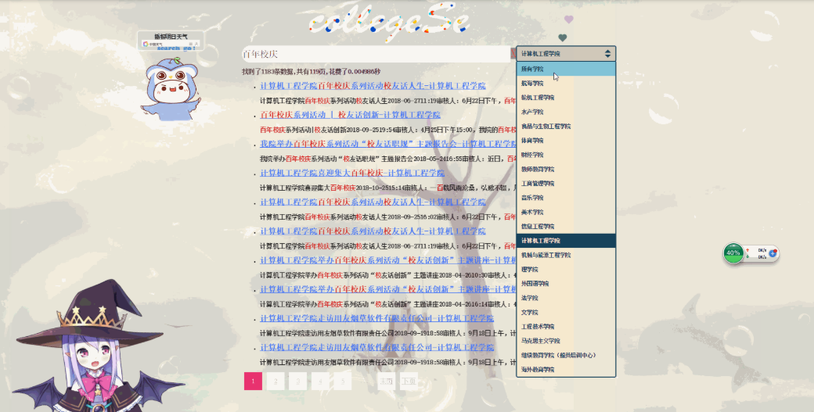

# 集美大学21个学院爬虫
# 0x1项目简介
主要是使用Scrapy框架对集美大学21个学院的网站数据进行爬取,然后用elasticsearch对数据进行检索，最后用python的django框架建立简单的搜索界面
爬取了网页连接、网页标题、网页正文内容。    

目录介绍:                   

JiMeiCrawlerTEXT  是爬取保存到文本             
JiMeiCrawlerMysql 是爬取保存到myql数据库                       
WebSE Web界面搜索                               

# 0x2运行环境
```bash
python3.x
scrapy框架
```
这里讲解一下安装scrapy爬虫框架可能遇到的一些问题。     
首先安装python3,并将python安装目录下的Lib/和
Scripts/路径中，添加到系统环境变量。       

window命令行下pip安装scrapy

```bash
pip install scrapy
```
如果出现如下错误:
```bash
building 'twisted.test.raiser' extension
error: Microsoft Visual C++ 14.0 is required. Get it with "Microsoft Visual C++ Build Tools": http://landinghub.visualstudio.com/visual-cpp-build-tools

```
到
http://www.lfd.uci.edu/~gohlke/pythonlibs/             


然后搜索twisted，下载python3.x对应的版本，如下图cp36就是python3.6x版本用的，win32是指的python的位数。        

然后在pip安装下载的文件：
例如: 
```bash
pip install Twisted-19.2.0-cp36-cp36m-win_amd64.whl
```

在运行项目中会出现如下问题:
```bash
    import win32api
ImportError: DLL load failed: %1 不是有效的 Win32 应用程序。
```
到 https://github.com/mhammond/pywin32/releases   
下载对应系统的位数和python对应的对应版本的exe，运行安装。


# 0x3运行步骤  
项目的spider/目录中有21个get_21个学院的子域名.py 脚本文件。       

在spider/目录中打开cmd 
输入如下命令    
例如:    
爬取计算机工程学院 
```bash
scrapy crawl cec
```

如果有报错缺少一些依赖包，根据报错的包名，安装相应的包。 

这里有两个版本，JiMeiCrawlerTEXT是爬取保存到文本、JiMeiCrawlerMysql是爬取保存到myql数据库          
      
两个版本的操作如下：    

## 0x3.1 JiMeiCrawlerTEXT
1)在spider/中建立一个infos目录         
2)在spider/中打开cmd,分别输入scrapy crawl 各个爬虫脚本的名字。(注意不是文件名，而是程序代码中name="爬虫名"的爬虫名)
```bash
scrapy crawl 爬虫名
```
## 0x3.2JiMeiCrawlerMysql:    
这里只测试爬取计算机工程学院的网站，并保存到代码中。 其他学院相似。    
在mysql数据库中
创建数据库
```bash
create database jimei;
```
创建表
```bash
create table cec (
url varchar(200) primary key,
title varchar(200) not null,
content text
);
```
修改settings.py文件
```bash
# 数据库地址
MYSQL_HOST = 'localhost'
# 数据库用户名:
MYSQL_USER = 'root'#修改为对应的数据库用户
#数据库密码
MYSQL_PASSWORD = '数据库密码'#修改为对应的数据库密码
#数据库端口
MYSQL_PORT = 3306
MYSQL_DBNAME = 'jimei' 
#数据库编码
MYSQL_CHARSET = 'utf8'
```
运行程序
```bash
scrapy crawl cec
```
# 0x4建立索引
将mysql的数据同步到Elasticsearch中建立索引。   

可以将elasticsearch搭建在window上，也可以搭建在linux上

详情可看此短文 ，本文是搭建在window上
https://blog.cfyqy.com/article/4bb939f5.html


# 0x5Web界面  
Web使用django框架写的，一个比较简单的搜索框。 
需要安装django和elasticsearch库的依赖。  
界面样貌如下：

